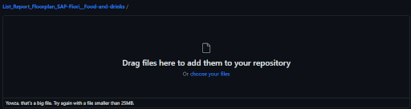

# List Report Floorplan Food and drinks
## Application developed during the course "Developing and Extending SAP Fiori Elements Apps"

  

  

## Não postei o arquivo pois o limite é de 25MB...

  

O SAP Fiori é uma abordagem de design e conjunto de tecnologias desenvolvidas pela SAP para melhorar a experiência do usuário em seus aplicativos empresariais. Ele visa proporcionar uma interface de usuário intuitiva, responsiva e moderna para os sistemas SAP, tornando mais fácil para os usuários interagirem com os dados e processos de negócios.

O Fiori oferece uma variedade de aplicativos, divididos em diferentes tipos, como aplicativos de transação, análise, informação e muitos outros. Cada tipo de aplicativo atende a uma necessidade específica dentro do ambiente empresarial.

Um dos tipos de aplicativo Fiori é o "List Report". Este aplicativo é projetado para fornecer aos usuários uma visão geral e detalhada dos dados em forma de lista, permitindo filtrar, classificar e agrupar os dados conforme necessário. O objetivo principal do List Report é fornecer aos usuários uma maneira eficiente de visualizar e interagir com grandes conjuntos de dados, como listagens de produtos, registros de clientes, registros de vendas, etc.

O aplicativo List Report no SAP Fiori geralmente possui as seguintes características:

1. **Visualização de Dados em Forma de Lista:** Os dados são apresentados em forma de lista, facilitando a visualização e compreensão.

2. **Filtros e Classificação:** Os usuários podem aplicar filtros para restringir os dados exibidos com base em critérios específicos. Eles também podem classificar os dados de acordo com diferentes campos.

3. **Agrupamento de Dados:** Os usuários podem agrupar os dados com base em certos campos para uma melhor organização e análise.

4. **Detalhes Expandidos:** Os usuários podem acessar detalhes adicionais sobre um determinado item da lista, geralmente através de uma visualização detalhada ou pop-up.

5. **Personalização da Exibição:** Os usuários podem personalizar a exibição da lista de acordo com suas preferências, selecionando os campos a serem exibidos ou ocultados.

Em resumo, o aplicativo List Report do SAP Fiori é uma ferramenta poderosa para visualização e interação com conjuntos de dados complexos, fornecendo aos usuários uma maneira eficiente de acessar e analisar informações essenciais para suas atividades comerciais.
